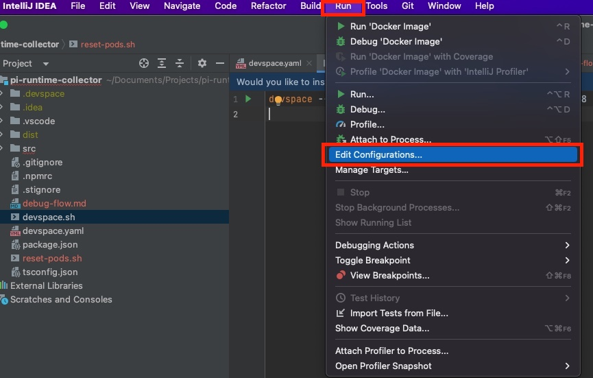
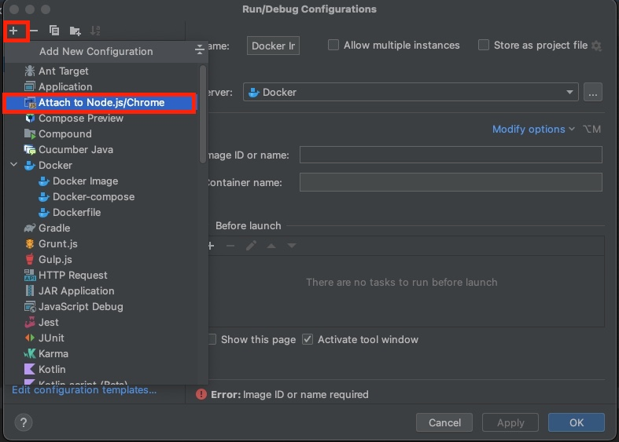
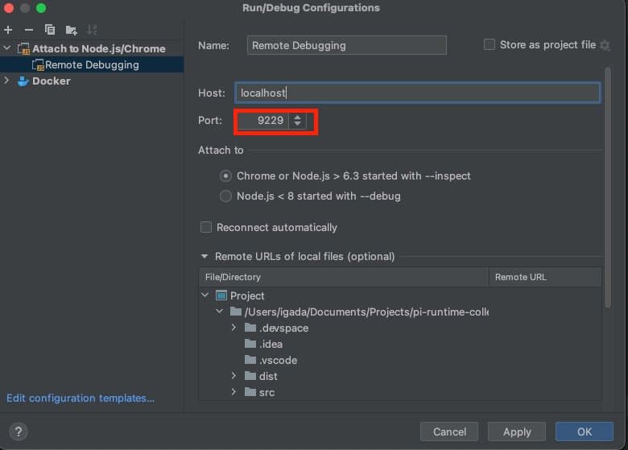
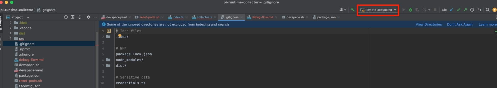

# Remote Debugging Tools

In this repo we will collect and document the usage for our remote debugging.

## DevSpace

DevSpace is a command line application that allows us to remotely sync file to a Kubernetes pod, porforward ports and deploy our applications to dev clusters.

### How to remotely debug an application using DevSpace?

- Install DevSpace CLI - [https://www.devspace.sh/docs/getting-started/introduction](https://www.devspace.sh/docs/getting-started/introduction)

- Clone the repository to your machine, and make the `context-selector,sh` script executable

```sh
git clone https://github.com/igadaaka/remote-debugging-tools.git
chmod +x remote-debugging-tools/context-selector.sh
```

- Copy the project's `devspace.yaml` at [project-config/devspace.yaml](./project-config/devspace.yaml) to you repository

- Open IntelliJ Idea, in your repository and add a remote debugging configuration (you will only need to this once per repo):

  - Click on `Run` -> `Edit Configurations`
    
  - Click on `+` sign to add a new configuration and select `Attache to Node.js/Chrome`
    
  - Name the new configuration, set the port to `9229` (the default NodeJS debugger port), and click `OK`
    

- Run the context-selector.sh script

```sh
/PATH/TO/REMOTE/DEBUGGING/REPO/context-selector.sh
```

- Follow the instructions on screen to select the cluster to debug and the required deployment if more than 1 matching deployments have been found

- Once you see the following message on screen it means that the debugger is ready and awaiting connections

```
Starting the application...
Debugger listening on ws://127.0.0.1:9229/8e182c4f-9af1-4138-bec8-f1bce00db7b0
For help, see: https://nodejs.org/en/docs/inspector
```

- To connect to the debugger, make sure that you have the selected the configuration we created earlier, and click `CTRL + D`
  

- Once you are done run the `reset-pods.sh` (it was be create automatically when you ran the `context-selector.sh`script) to resume the deployment to normal state.

```
./reset-pods.sh
```
